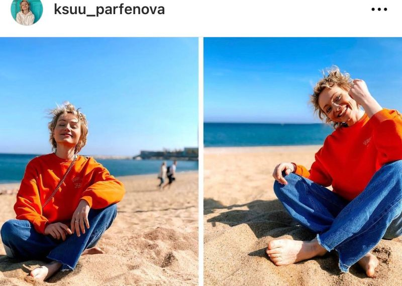

Ksenia Parfenova has been working in the structures of Yevgeny Prigozhin since 2014: she started at the “troll factory” in Olgino, and then moved to work at Politika Segodnya. This media outlet is part of Prigozhin’s Patriot media group, which has come under EU sanctions.  
  
In February 2023, Parfenova applied for a Spanish student Schengen, submitting a certificate of employment. According to her, when the EU imposed sanctions against the Patriot group on February 25, she already mentally said goodbye to the visa. “But on March 1, they invited me for a passport. Unbelievable, but they did!” - the girl rejoices.  
  
Now Parfyonova is in Barcelona and has no plans to return to Russia yet.  
  
UPD: After the publication of this fact in media, the Instagram account was closed or deleted.

