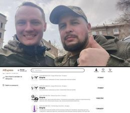

Russian volunteer ordered $25,000 worth of sex toys instead of drones for the Russian Armed Forces - InformNapalm.  
  
Ukrainian hackers from Cyberport managed to hack the AliExpress account of volunteer Mikhail Luchin and "correct" the order for the funds raised by the volunteer.  
  
They could not be forwarded to the Armed Forces of Ukraine, because the card is tied to a specific address, but Luchin will no longer be able to cancel the order 😁

